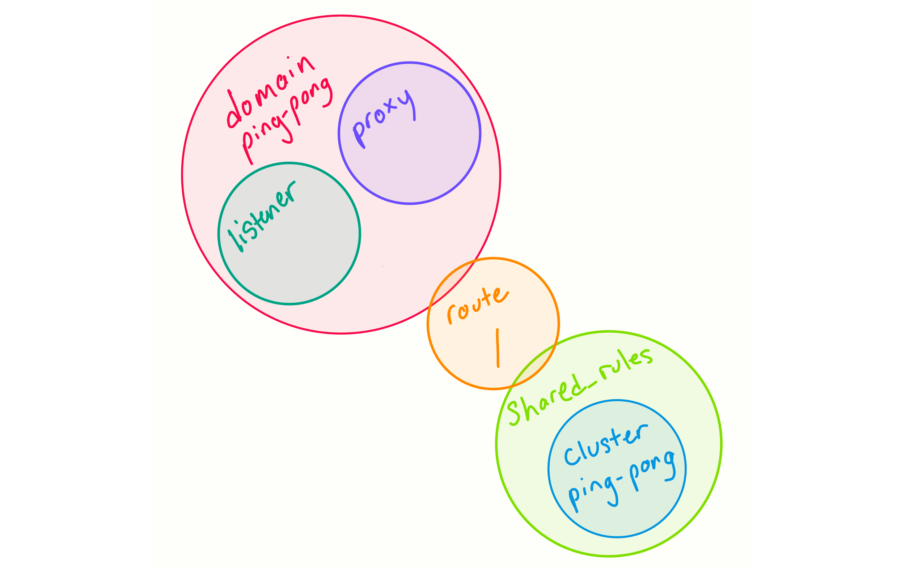
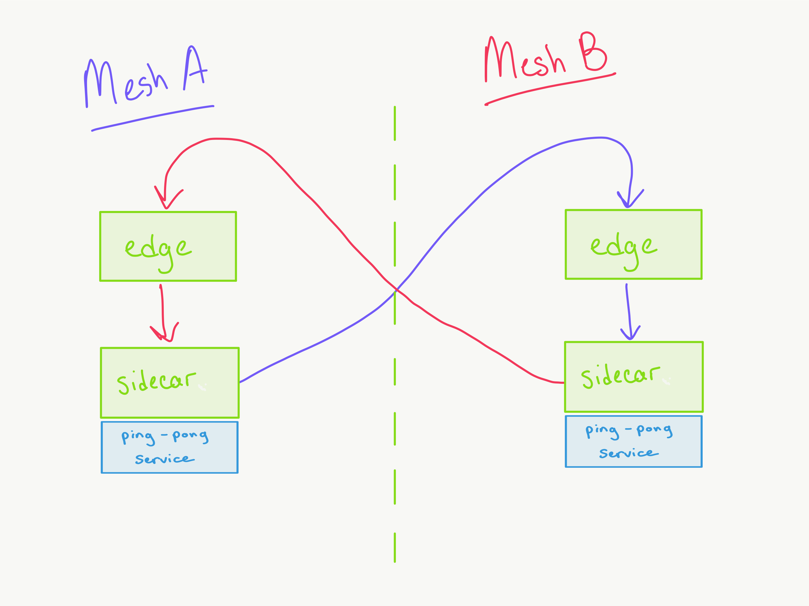
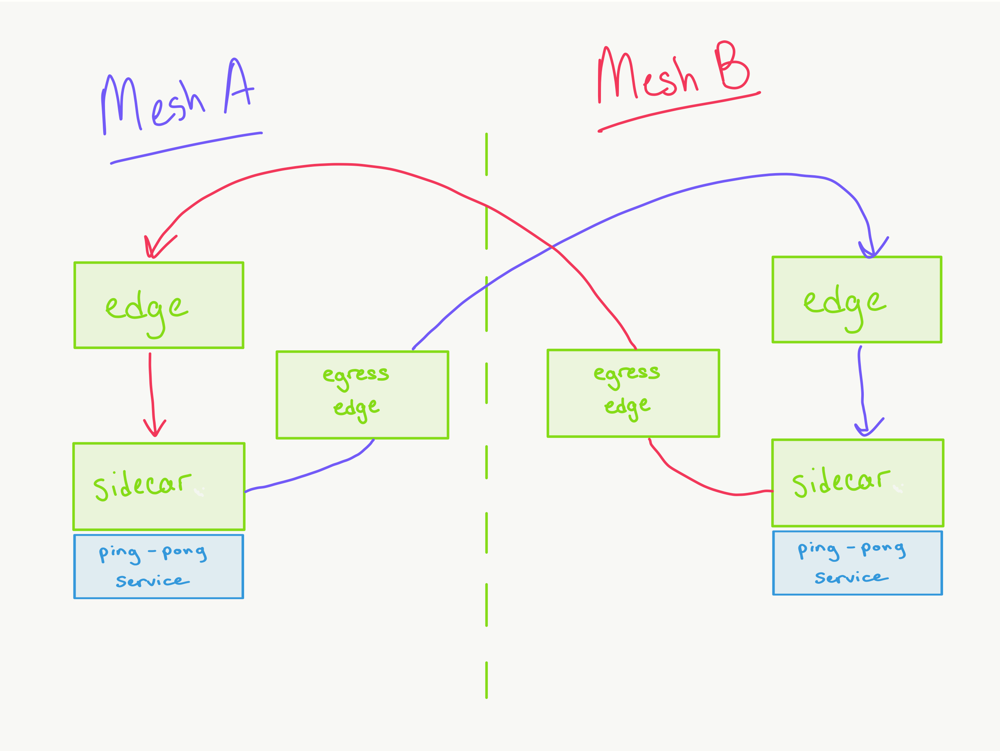

# Table of Contents

- [Table of Contents](#table-of-contents)
- [Multimesh](#multimesh)
  - [Setup](#setup)
  - [The players](#the-players)
  - [Controlling the mesh](#controlling-the-mesh)
  - [Configuring the mesh](#configuring-the-mesh)
    - [Routing](#routing)
  - [Multimesh Communication: Part I Service to Ingress Edge Setup](#multimesh-communication-part-i-service-to-ingress-edge-setup)
    - [Configuring the cluster](#configuring-the-cluster)
    - [Configuring the shared_rules](#configuring-the-sharedrules)
    - [Configuring the routes](#configuring-the-routes)
  - [Playing ping pong](#playing-ping-pong)
  - [Multimesh Communication: Part II Egress Edge Proxy Setup](#multimesh-communication-part-ii-egress-edge-proxy-setup)
  - [Authors](#authors)

# Multimesh

Multimesh refers to a deployment model which consists of two or more service meshes that can communicate with each other. In this workshop, we'll walk through two different ways to accomplish this pattern and learn a little more about the Grey Matter mesh along the way.

The objective for today is to get your mesh to communicate with your partner's. In addition to the core Grey Matter services, there are two additional services deployed in your mesh: the Ping Pong service and an egress Edge proxy. We're going to configure the Ping Pong service to play a game with the other mesh, and then update this configuration to use the egress proxy as a bridge between meshes.

The first half of this workshop talks through what a mesh is, what Grey Matter does, and how the configuration API works. If you're already a mesh master, feel free to start from [Multimesh Communication: Part I Service to Ingress Edge Setup](#multimesh-communication-part-i-service-to-ingress-edge-setup)

## Setup

You should have received keys to an already running EC2 instance. To get started, log in to your EC2 and run `setup`:

```bash
# ssh into ec2 if you haven't already
ssh -i certificate.pem ubuntu@your-ec2-instance.compute-1.amazonaws.com
# start the mesh on the ec2 instance
setup
```

You'll be prompted for the username and password that you use to log in to [Nexus](https://nexus.production.deciphernow.com/). The setup will take 3-5min, so go ahead and read the next section while you wait. If the setup was successful, you should see `The mesh is ready at https://$PUBLIC_IP:30000 !` printed to the console.

## The players

Before we get into multiple meshes, let's talk about what makes up a single mesh. At it's most basic, the Grey Matter mesh is comprised of the following:

- [Grey Matter Proxy](https://github.com/deciphernow/gm-proxy)
- [Grey Matter Control](https://github.com/deciphernow/gm-control)
- [Grey Matter Control API](https://github.com/deciphernow/gm-control-api)

The Proxy can be deployed in different ways - either as a standalone proxy or as a **sidecar** proxy that sits alongside each microservice in the mesh.

In a typical deployment, we have a gateway that handles the initial authentication/authorization checks and is aware of all the sidecars in the mesh. This is the standalone proxy deployment we usually call the "Edge" node, because it handles **north-south traffic**, or requests coming in and out the mesh.

The sidecar, (remember, same proxy, configured differently), represents the service it sits in front of - it's the only thing that knows about where the actual service lives and how to connect to it. Sidecars usually have a smaller scope. They typically aren't configured to know about every other sidecar in the mesh like Edge does. They only know about a subset of other sidecars. We call this communication between sidecars **east-west traffic**.

This network of proxies is what we mean when we say _mesh_. The term *mesh* originates from an overall framework of using [smaller, dynamic nodes to route traffic](https://en.wikipedia.org/wiki/Mesh_networking).


_Image: A diagram representing a network of services and sidecars. The green box represents a service and the blue is the network of sidecars._

> True or false: The Edge proxy and the Grey Matter sidecar are two different pieces of software with unique roles.

## Controlling the mesh

So how do these proxies "know about" each other? How do they handle authentication/authorization? How do they know where to route requests? That's where Grey Matter Control and Control API come in to play. They form the basis of what we call the **control plane**. The control plane is the _how_ of the mesh. It is pulls the strings and tells the mesh how to behave.

Grey Matter Control is the piece that performs service discovery ("Where do all the sidecars live?") and dynamic distribution of configuration ("Here's your new configuration, sidecar!"). That means we can configure the mesh even after it's been deployed, which is a big deal! In the olden days, configuration was static, and in order to make changes, services would have to be redeployed with updated configuration.

The last piece is the Control API service - this is how we the developers actually interact with the control plane and make it do cool stuff! The Control API server holds and manages the configuration of all proxies throughout the Grey Matter Mesh.

When we configure the mesh, the Control API sends our updates off to Control. Control turns our configuration into something that the proxy understands and then distributes that to the relevant sidecars.

> _How do the Control service, the Control API, and the Grey Matter proxy interact?_

## Configuring the mesh

We've talked about the "physical" components of the mesh - a proxy, a discovery/configuration service, and an API service.

The Grey Matter API implements an abstraction layer on top of this software. This takes the form of json objects that logically isolate parts of the configuration for fine-grained control and modularity.

Here are the Grey Matter API objects that represent a service\* in the mesh. These configurations answer the questions, "Who am I?" "How should I handle requests?" and "Where do other services live?"

_\*When we talk about a "Service" in the mesh, we are referring to a pair of sidecar + service. Remember, the sidecar is what really represents the service as a "citizen" of the mesh._

**The WHO**: objects that make up the identity of the service

- **domain**: You can think of a domain as the service's _scope_. By linking a route to a service's domain, you tell it what clusters it can access. It also handles ingress TLS configuration, i.e. connections between proxies.
- **proxy**: This is what associates our configuration with the "physical" deployment of the sidecar. The `name` field corresponds with a Kubernetes deployment label.
- **listener**: Defines the host, port, and protocol for a proxy within the mesh.

**The HOW**: objects that define how a service handles requests

- **route**: Registers a path with the proxy and configures any necessary path rewrites or redirects
- **shared_rules**: Sets up traffic rules, telling the proxy how to route a path. This is where you control load balancing and could implement traffic shadowing or A/B testing.

**The WHERE**: The object that tells a service where other network-addressable things live

- **cluster**: Lists IP addresses and ports where requests can be sent

Below you'll see a visualization of how the Ping Pong service is configured and how all these objects relate to one another. Circles overlap where the objects link. `domain` is the parent object of `proxy`, `listener`, and `route`. There is only one route defined for this service, the root route `/`, which points to the ping-pong service cluster via a `shared_rules` definition.

An important thing to note here is that the Ping Pong cluster is not directly tied to the service itself. This cluster object can be used by any other service via a route:



### Routing

Let's take a second to talk about how a service knows about other network addressable locations, whether that location is another service in the mesh, a serverless function, or a completely different mesh altogether! We'll use the Ping Pong service as an example.

In your terminal, run the following command, which will exec into the Ping Pong service sidecar and hit the admin endpoint to list all the clusters this sidecar knows about. This is how we can see what configuration the sidecar got from GM Control*.

```sh
kubectl exec -it $(kubectl get pods --template '{{range .items}}{{.metadata.name}}{{"\n"}}{{end}}' | grep '^ping-pong') -c sidecar curl localhost:8001/clusters
```

This endpoint lists all the `clusters`, or network addressable locations, that our Ping Pong Service has been configured to route to. You should see something like:

```sh
xds_cluster::10.100.12.42:50000::cx_active::1
xds_cluster::10.100.12.42:50000::cx_connect_fail::1
xds_cluster::10.100.12.42:50000::cx_total::2
...
service::0.0.0.0:3000::cx_active::0
service::0.0.0.0:3000::cx_connect_fail::0
service::0.0.0.0:3000::cx_total::0
...
```

The Ping Pong sidecar knows about 2 other `clusters`: GM Control (`xds_cluster`), e.g., the thing that gave it it's configuration, and the actual Ping Pong `service`. From the Ping Pong sidecar's point of view, these are the only clusters that exist in the mesh.

To get a service to "know about" another and end up in that list of clusters, we need to configure 3 objects: `cluster`, `route`, and `shared_rules`. If you scroll back up to the Ping Pong configuration diagram, you'll see how the route is really the link between the service and the cluster.

> _Try comparing the Ping Pong service clusters to the Edge service clusters. How and why are they different? To see edge clusters, you can run `kubectl exec -it $(kubectl get pods --template '{{range .items}}{{.metadata.name}}{{"\n"}}{{end}}' | grep '^edge') curl http://localhost:8001/clusters`_

_*The admin endpoint is a great tool for debugging the mesh. All the proxies in this mesh are deployed with the admin port exposed on 8001. There are many other endpoints besides /cluster that you can explore to understand how the proxy was configured. See the [envoy admin docs](https://www.envoyproxy.io/docs/envoy/latest/operations/admin) for more detailed info._

## Multimesh Communication: Part I Service to Ingress Edge Setup

Now that we understand the configuration that makes up a service and how we can get a service to "know" about another, let's apply this knowledge to our first multimesh example.

The goal is for the Ping Pong service in your mesh to talk to the Ping Pong service in your partner's mesh. This service is simply a [passthrough service](https://github.com/dgoldstein1/passthough-service) that has been configured to make requests to `/mesh2/services/ping-pong/latest/` when you /ping it.
The request should travel from the service, to your partner's Edge node, to your partner's Ping Pong service:

> _Think through how you would implement the diagram below using the CLI. Talk it out with your partner._



### Configuring the cluster

The first step is to configure a `cluster` that points to your partner's mesh. In your terminal, run:

`echo $PUBLIC_IP`

Trade IP addresses with your partner.

Open `cluster-mesh-2.json` by running:

```sh
vim cluster-mesh-2.json
```

There are a couple things to note here:

- The `ssl_config` field defines the credentials that are expected to be present on disk when a proxy routes to this cluster. This has already been filled out for you and the client certs for the Edge node have been added to the Ping Pong sidecar.
- Notice that the cluster object doesn't link to any other object except the very top level zone object. Clusters can link to as many services as you want via `shared_rules`.

To edit the file, hit `i` for interactive mode. Replace `x.x.x.x` in the instances array with the IP that you noted from your partner. Hit `esc` and then `:wq` to save the file. To apply the file, run:

```sh
greymatter create cluster < cluster-mesh-2.json
```

Double check that you see your partner's IP address in the instances array.

### Configuring the shared_rules

Next, we'll create a shared_rule that points to the cluster we just made. You can think of `shared_rules` like traffic management configuration. Run `cat shared-rule-mesh-2.json` and notice how it directs requests to the `cluster-mesh-2` we just created.

```sh
greymatter create shared_rules < shared-rule-mesh-2.json
```

### Configuring the routes

Finally we can create the route objects, which connect the mesh-2 cluster with the Ping Pong service. Run `cat route-ping-pong-to-mesh-2.json` and `cat route-ping-pong-to-mesh-2-slash.json`. Notice how they both point to the `shared_rules` object we just created.

- This is where we actually define a route for a particular proxy through the domain `domain-ping-pong`. If we wanted a different service to know about the mesh-2 cluster, we would need to create a new route using that service's domain, pointing to the same shared_rules object.
- The `prefix_rewrite` field is what the request will look like when the request hits the target cluster.
- Because of how GM Control handles trailing slashes, we need 2 different route objects for the same path. Don't worry about it right now, just make sure to create the routes in the correct order.

Go ahead and execute the following commands:

```sh
# It is very important to create routes in this order!
greymatter create route < route-ping-pong-to-mesh-2-slash.json
greymatter create route < route-ping-pong-to-mesh-2.json
```

Let's check the Ping Pong sidecar's clusters to confirm everything is working correctly.

```sh
kubectl exec -it $(kubectl get pods --template '{{range .items}}{{.metadata.name}}{{"\n"}}{{end}}' | grep '^ping-pong') -c sidecar curl localhost:8001/clusters
```

If the configuration was successful, you should see the mesh2 cluster somewhere in that list with the IP and port we configured. 

The image below shows how we've configured the Grey Matter objects so far:


## Playing ping pong

At this point, check with your partner to see if they have successfully completed the steps above. If they have, we're ready to play!

You and your partner should follow the logs for the Ping Pong service in your respective meshes:

```sh
kubectl logs $(kubectl get pods --template '{{range .items}}{{.metadata.name}}{{"\n"}}{{end}}' | grep '^ping-pong') -c ping-pong -f
```

Pick **one** person to initiate the game and run the following command in another tab.

`curl -k --cert client.crt --key client.key https://$PUBLIC_IP:30000/services/ping-pong/latest/serve`

In your logs, you should see something like:

```sh
Received ping from localhost:8080. Connection type: HTTP/1.1
hitting back to: https://localhost:8080/mesh2/services/ping-pong/latest/ping?pause=2
sleeping for 1 s
```

When the ball goes out of bounds, the game is over! Hit `ctrl+c` to exit the logs.

## Multimesh Communication: Part II Egress Edge Proxy Setup

The second configuration uses an _egress_ edge proxy, which acts as a bridge between the meshes. Instead of pointing each service to the ingress edge of the other mesh, only the egress proxy knows about the second mesh and all services route to it instead. This can be beneficial for security and for monitoring cross-mesh traffic. In this scenario, sidecars that want to talk to the other mesh don't need to know how to authenticate with it, they just need to be able to talk to the egress proxy.



There is already an `egress-edge` proxy deployed into your environment, we'll just need to tweak the configuration to make this work.

Run the following and change the `shared_rules_key` to `shared-rules-egress-edge`. Hit `i` to enter interactive mode and `:wq` to save and apply.

```sh
# Edit both routes to use the`shared-rules-egress-edge` shared_rules key
greymatter edit route route-ping-pong-to-mesh-2-slash
greymatter edit route route-ping-pong-to-mesh-2
```

Next, create a route for the egress cluster <-> mesh #2:

```sh
greymatter create route < route-egress-to-mesh-2.json
```

Here's a diagram of the configuration we just implemented:


Let's confirm that we've set up all the routes correctly for egress-edge. Hit the admin endpoint of the egress-edge proxy by running:

```sh
kubectl exec -it $(kubectl get pods --template '{{range .items}}{{.metadata.name}}{{"\n"}}{{end}}' | grep '^egress-edge') curl localhost:8001/clusters
```

You should see something like:

```sh
xds_cluster::10.104.2.48:50000::cx_active::2
xds_cluster::10.104.2.48:50000::cx_connect_fail::4
xds_cluster::10.104.2.48:50000::cx_total::6
...
mesh2::54.80.76.176:30000::cx_active::0
mesh2::54.80.76.176:30000::cx_connect_fail::0
mesh2::54.80.76.176:30000::cx_total::2
```

This validates that the egress-edge is looking for a cluster `mesh2` and has found it at the endpoint `54.80.76.176:30000`. Follow the logs for Ping Pong again:

```sh
kubectl logs $(kubectl get pods --template '{{range .items}}{{.metadata.name}}{{"\n"}}{{end}}' | grep '^ping-pong') -c ping-pong -f
```

In another tab, initiate the game just like we did before:

`curl -k --cert client.crt --key client.key https://$PUBLIC_IP:30000/services/ping-pong/latest/serve`

The game should look exactly as it did in the previous setup. Once someone wins, hit `ctrl+c` to exit the logs. Now take a look at the logs for our egress-edge proxy:

```sh
kubectl logs $(kubectl get pods --template '{{range .items}}{{.metadata.name}}{{"\n"}}{{end}}' | grep '^egress-edge') -f
```

You should see all the requests from the Ping Pong service.

## Authors
Kaitlin Moreno - kaitlin.moreno@deciphernow.com

Thanks to [David Goldstein](http://www.davidcharlesgoldstein.com?ping-pong-multimesh) for his work developing the multimesh Ping Pong example!

